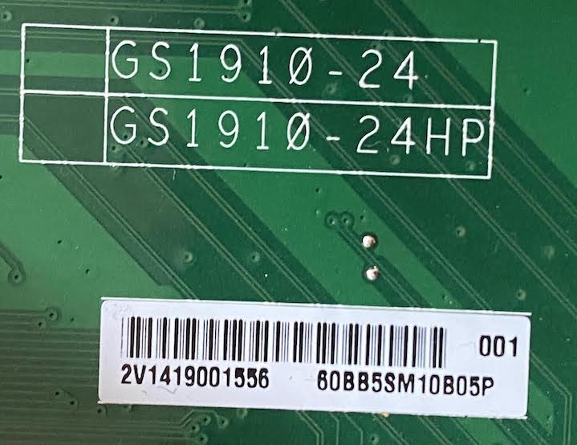
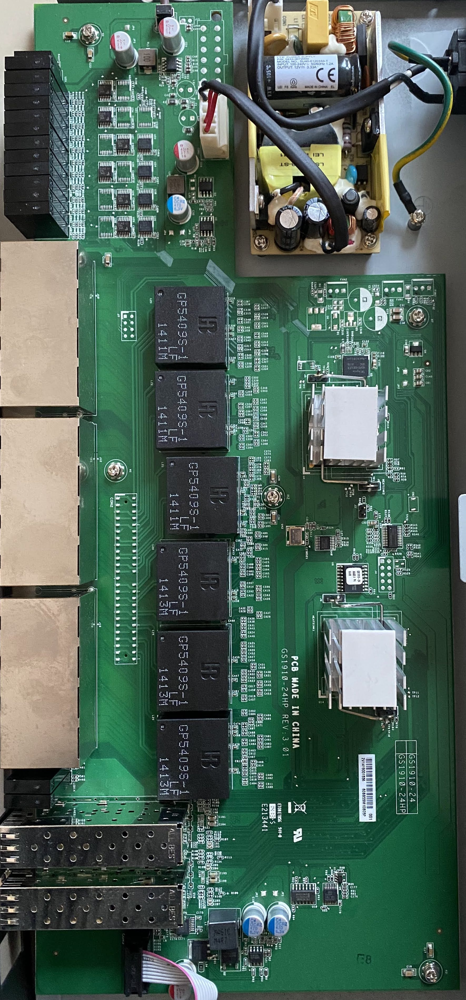
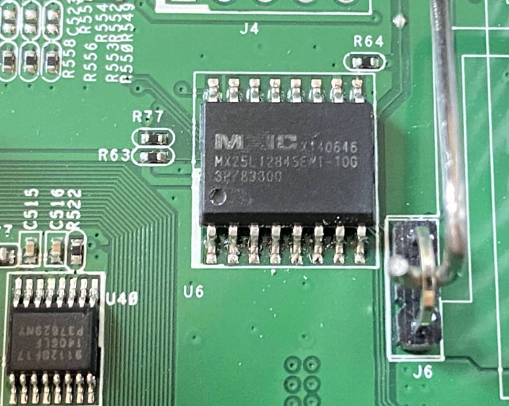
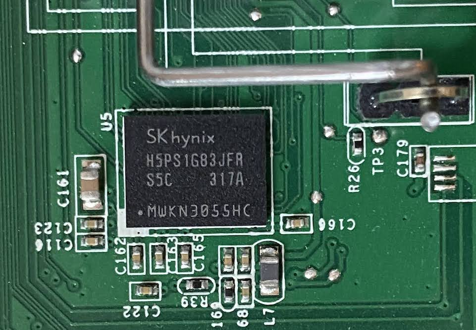
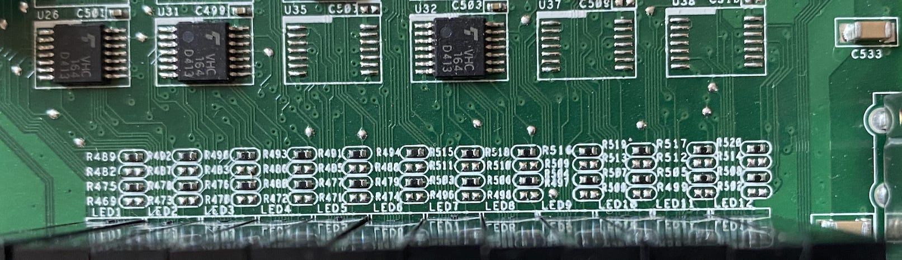
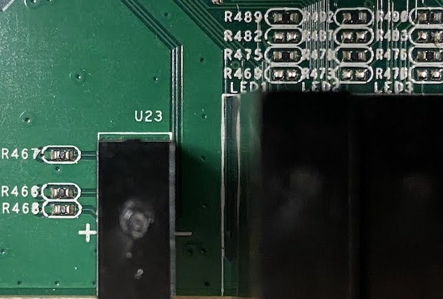
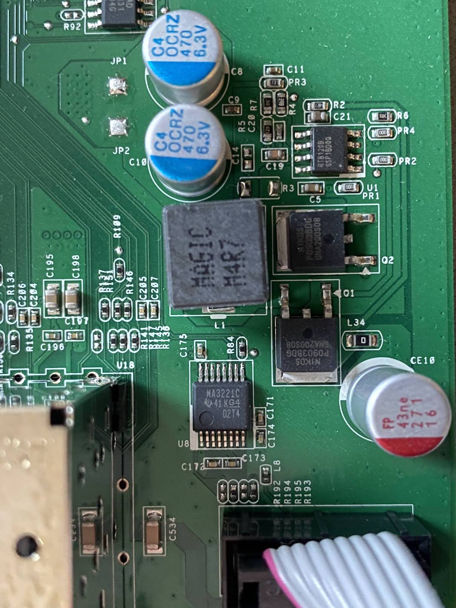
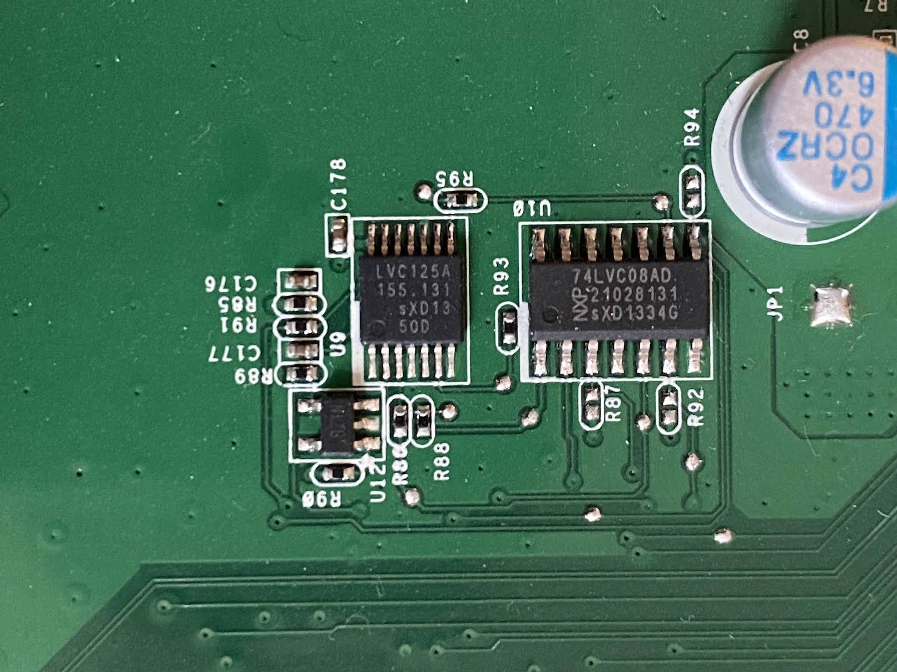
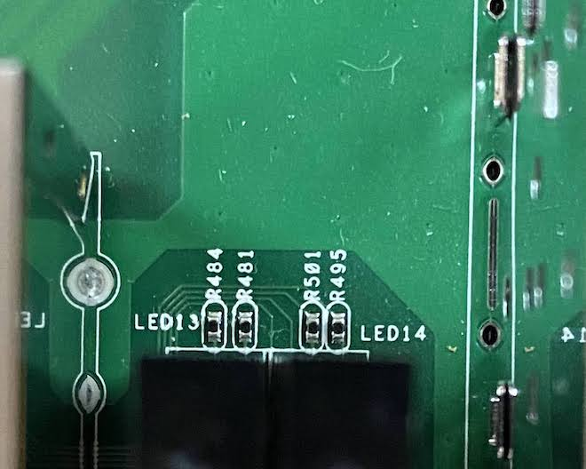

# The ZyXEL GS1910-24 and GS1910-24HP

This device reached EOL in 2014, although it is still a capable 1Gbit switch.

[Deviwiki suggests](https://deviwiki.com/wiki/ZyXEL_GS1910-24) the chipset is a Vitesse VSC7427

The heatsinks were fairly well welded onto the SoCs, so I left those in place for the photos.

### Console Port

For local management, you can use a computer with terminal emulation software
configured to the following parameters:

* VT100 terminal emulation
* 115200 bps
* No parity, 8 data bits, 1 stop bit
* No flow control

Connect the male 9-pin end of the RS-232 console cable to the console port of the
Switch. Connect the female end to a serial port (COM1, COM2 or other COM port)
of your computer.

## Datasheets

[Datasheets](datasheets/)

## Manual

[Manual](manual/)

## Board pictures and details

Board Label

Overview

128 Mbit Serial Flash chip

1GBit DDR2 SDRAM

Main LEDs

Power LEDs

Serial Port overview 1

Serial Port overview 2

SFP LEDs

